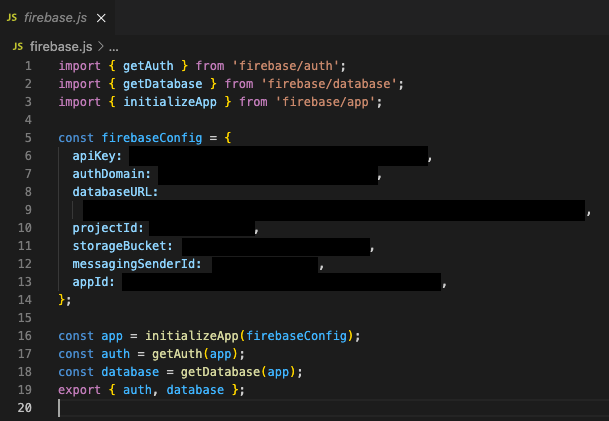
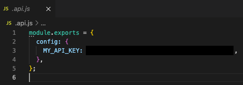

# <b>WalkEase App</b>

##   <b>Intro</b>

This is the final project completed by a group of 6 during the Northcoders full stack web development bootcamp. WalkEase is a mobile app built using React Native and Expo for the frontend and using Firebase (and various APIs) for the backend. The app is designed to help busy dog owners who don't always have time to walk their dogs to connect with people who wish to walk dogs but may not have their own. 'Owner' users will be able to add dogs to their account, where they can then list them to be walked. 'Walker' users are able to see a map view of all the walks available, a list view is also available below.

##   <b>How to try our App</b>

### <b>Step 1</b> - Install "Expo Go" on iOS or Android device:

For iOS: https://apps.apple.com/us/app/expo-go/id982107779 For Android: https://play.google.com/store/apps/details?id=host.exp.exponent&hl=en_GB&gl=US

### <b>Step 2</b> - Scan the QR code OR click the link from your mobile device:

[Open App in Expo](exp://exp.host/@willmcb94/walkease?release-channel=default)

#### Important

IOS users will need to request permission to access the app, please email us at walkease@yahoo.com and we will go ahead and give you viewing rights on the app.

### <b>Step 3</b> - Try it out!

As an FYI the app is completely functional on both Android and IOS however it is best viewed on IOS as react native styling appears differently on both platforms and we decided to gear the styling towards use on IOS.

We welcome any feedback about our project!

##   <b>How to set up your own WalkEase App</b>

### <b>Step 1</b> - Clone this GitHub repository

`'git clone https://github.com/WalkEase/walkease.git'`

### <b>Step 2</b> - Add files containing your own API keys

These must be added in the root directory of the repository and should look like this:

  For Firebase config... (firebase.js)

  For GoogleApi config... (.api.js)

### <b>Step 3</b> - Install npm packages, scripts to run

Next, you must install all required dependencies

- `'npm i'` (this may take a while the first time)

  Useful scripts (also found in 'package.json'):

- `'npm run start'` (starts app then allows you to pick platform)
- `'npm run ios'` (starts app for ios)
- `'npm run android'` (starts app for android)

### <b>Step 4</b> - Mess around a bit!

You should now be able to start the app using the aforementioned scripts!

For more info on Expo, they have excellent docs: https://docs.expo.dev/
